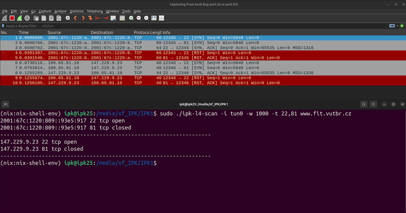
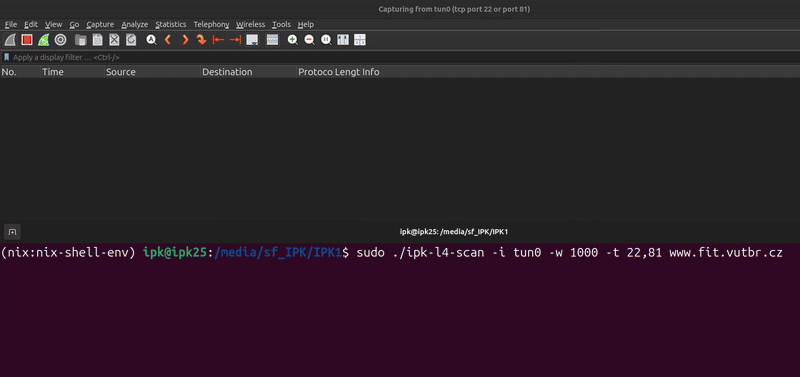
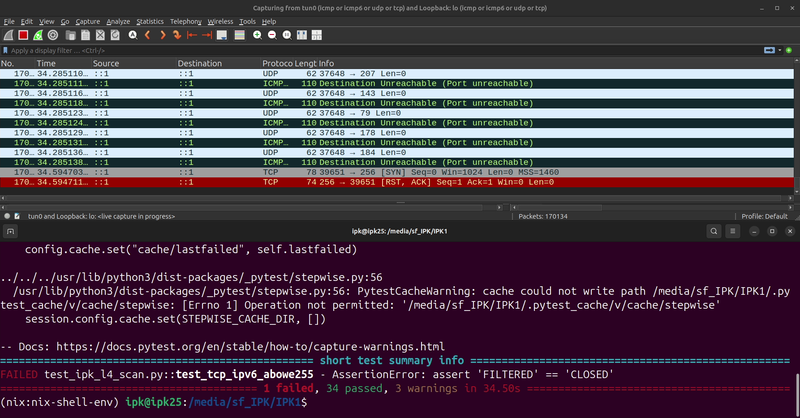
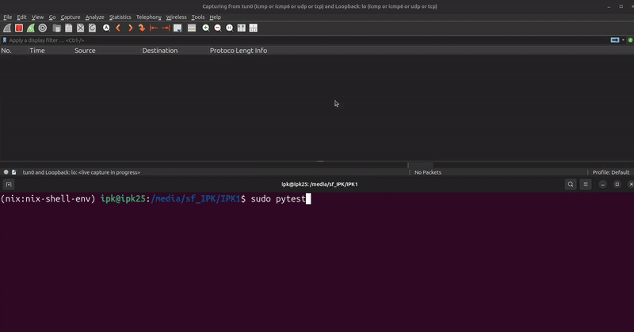

# Dokumentace k projektu **ipk-l4-scan**

## **Rozcestník obsahu**
- [1. **Výkonný souhrn (Executive Summary)**](#1-výkonný-souhrn-executive-summary)
- [2. **Krátký teoretický základ**](#2-krátký-teoretický-základ)
- [3. **Struktura a architektura (narrative)**](#3-struktura-a-architektura-narrative)
- [4. **Testování**](#4-testování)
  - [4.1 **Společné testovací podmínky**](#41-společné-testovací-podmínky)
  - [4.2 **TCP testy**](#42-tcp-testy)
  - [4.3 **UDP testy**](#43-udp-testy)
  - [4.4 **Kontrola paměťových úniků pomocí Valgrindu**](#44-kontrola-paměťových-úniků-pomocí-valgrindu)
- [5. **Rozšířená funkcionalita**](#5-rozšířená-funkcionalita)
- [6. **Bibliografie**](#6-bibliografie)

---

## 1. **Výkonný souhrn (Executive Summary)**
Aplikace **ipk-l4-scan** slouží ke skenování portů na úrovni L4 (transportní vrstvy), konkrétně podporuje **TCP** a **UDP** sken. Pro **TCP** používá raw socket (a sestavuje hlavičku IPv4 či IPv6 ručně), pro **UDP** naopak využívá klasické `SOCK_DGRAM`. Odezvy zachytává knihovna **libpcap**, přičemž výsledný stav portů určuje na základě doručených paketů (SYN+ACK, RST, ICMP unreachable, atd.).  
Projekt je napsán v jazyce C – hlavní logiku tvoří funkce a struktury. Mezi zajímavé prvky patří **chunking** portů pro paralelní zpracování, podpora **IPv6** včetně link-local adres a možnost **předčasného ukončení** při kompletních odpovědích.  
Dále je v **TCP skenu** implementováno **dvojí skenování** pro porty, které vyšly jako `FILTERED` v prvním kole. Po skončení prvního průchodu se takto „vyselektují“ filtered porty a zkusí se je oslovit podruhé (detail viz implementace ve funkci `filter_ports()`).

---

## 2. **Krátký teoretický základ**
Port skenování je klasický postup k ověření, zda na cílovém systému běží služby na určených portech. V našem projektu se zaměřujeme především na **TCP** a **UDP** protokoly.

1. **TCP scanning**  
   - Většinou se používá takzvaný *SYN scan*, kdy je na cílový port odeslán **SYN** segment.  
   - Pokud cílový host odpoví **SYN+ACK**, port je označen jako **open** (pravděpodobně tam poslouchá služba).  
   - V případě odpovědi **RST** se port vyhodnotí jako **closed**.  
   - Když nedorazí žádná odpověď, je port považován za **filtered** (může být blokován firewallem).  
   - Tento přístup se někdy nazývá *“half-open” scan*, protože neproběhne úplný třífázový handshake.

2. **UDP scanning**  
   - Pro každý cílový port se odesílá **UDP** datagram.  
   - Pokud dorazí **ICMP port unreachable** (v IPv4 typ 3, kód 3; v IPv6 „dst unreachable“), daný port je **closed**.  
   - Pokud se ICMP zpráva neobjeví, je port chápán jako **open** (resp. *open|filtered*), neboť neexistence odpovědi může znamenat otevřený port nebo filtraci.

3. **Technická implementace**  
   - U **TCP** využíváme *raw sockets* (např. protokol `IPPROTO_RAW`), a je nutné *ručně* sestavovat IPv4/IPv6 hlavičku i TCP hlavičku.  
   - U **UDP** postačí běžný `SOCK_DGRAM`; o vyplnění hlaviček se postará kernel.  
   - Pro zachytávání příchozích paketů (ACK, RST, ICMP apod.) slouží **libpcap** s BPF filtry, což umožňuje číst síťový provoz v reálném čase.

> **Poznámka k IPv6**: Při odesílání *raw TCP* paketů v IPv6 není k dispozici obdoba `IP_HDRINCL` z IPv4, a proto je nezbytné sestavit kompletní hlavičku (version, flow label, hop limit, src/dst adresy) plus TCP hlavičku.

---

## 3. **Struktura a architektura (narrative)**
Projekt se skládá z šesti hlavních souborů:

1. **`main.c`**  
   - Zpracovává argumenty přes `getopt_long`, parsuje porty, řeší spouštění *chunk_send()* pro TCP / UDP vlákna.
   - Ukládá a tiskne výsledky skenu po dokončení.

2. **`scan_tcp.c`**  
   - Vytváří raw socket pro **IPv4** / **IPv6**, sestavuje hlavičku IP + TCP a odesílá SYN.  
   - Pomocí pcap loop zachycuje odpovědi (SYN+ACK / RST) a vyhodnocuje stav portu.

3. **`scan_udp.c`**  
   - Vytváří **`SOCK_DGRAM`** socket, odesílá UDP.  
   - Zachycuje `ICMP unreachable` (IPv4 / IPv6) a označuje port jako **closed** (jinak open).

4. **`interfaces.c`**  
   - Obsahuje funkce pro zjištění aktivních rozhraní (`list_active_interfaces()`) a **`get_interface_address()`** (IPv4/IPv6) včetně link-local.

5. **`utils.c`**  
   - Pomocné funkce: **výpočet checksumů** (TCP IPv4, TCP IPv6), **parsování portů**, filtrace portů (FILTERED → opakovaný sken), atd.

6. **`l4_scan_types.h`**  
   - Definuje struktury (`scan_task_t`, `capture_user_data_t`, atd.) s parametry pro sken, seznam portů, semafory apod.

> **Použití**:  
> `./ipk-l4-scan {-h} [-i interface | --interface interface] [--pu port-ranges | --pt port-ranges | -u port-ranges | -t port-ranges] {-w timeout} [hostname | ip-address]`

### **Chunking portů**  
Funkce `chunk_send()` v souboru `main.c` rozděluje seznam portů do menších bloků, přičemž každý blok je skenován samostatným vláknem (pomocí `pthread_create()`). Tento přístup umožňuje paralelní zpracování a zrychluje skenování, zejména při velkém počtu portů. Jelikož při příjmu paketu pomocí knihovny pcap procházíme pole portů a hledáme příchozí port v poli skenovaných portů, je vhodné tuto operaci co nejvíce optimalizovat. Proto je každému vláknu přidělen unikátní port, jehož správa je zajištěna pomocí semaforu.

### **Rozdíly mezi TCP a UDP**  
- **TCP**: ruční sestavení IP + TCP hlavičky, identifikace SYN+ACK / RST v callbacku.  
- **UDP**: posílá obyčejné datagramy, a closed odhalujeme přes ICMP unreachable. Bez odpovědi port interpretován jako open.

---

## 4. **Testování**

### 4.1 **Společné testovací podmínky**
- **Jak bylo testováno:**  
  Bylo využito **vlastních pytest testů**, které pro vybrané porty volají `./ipk-l4-scan` a paralelně spouštějí **nmap** pro srovnání stavů. Python skript porovnává, zda je výstup (open/closed/filtered) shodný.  
- **Testovací prostředí:**  
  Běželo ve virtualizovaném Ubuntu 24.04.1 LTS s Nix. Pro IPv6 konektivitu byla použita školní VUT FIT VPN, která umožnila odesílání a příjem IPv6 paketů i v jinak omezeném virtuálním prostředí.
- **Co bylo testováno (obecně):**  
  Testovalo se, jestli se aplikace chová podle specifikace a zda nedochází k úniku paměti pomocí valgrindu.

Nainstalované nástroje: python3, valgrind, nmap, libpcap.

### 4.2 **TCP testy**
#### Co se testuje a proč
Chceme ověřit, že **TCP** sken správně identifikuje stavy open/closed i pro IPv4 i pro IPv6. Zároveň testujeme výkon a spolehlivost při menším počtu portů (~10 portů), středním počtu portů (~100 portů) a vysokém počtu portů (~10000 portů). Běžné situace (menší počet portů) a situace, kdy se chunking reálně projeví (větší množství portů).  
Zde jsou popsány ty nejzákladnější testy s menším počtem portů, **na těchto příkladech se neprojeví chunking**.

- **TCP IPv4** a **TCP IPv6**  
- Zde testujeme nejzákladnější požadavky aplikace (stavy open, closed, případně filtered).

#### Vstupy, očekávané a reálné výstupy
Všechny testy využívají:
- Timeout: **1000** ms

> **Příklad použití**:  
> `sudo ./ipk-l4-scan -i tun0 -w 1000 -t 22,81 www.fit.vutbr.cz`

Následuje ukázková tabulka **třídy ekvivalence** pro *TCP*:

| #   | TCP porty | UDP porty | Interface | IP adresa                    | Očekávaný výstup (nmap)  | Reálný výstup (ipk-l4-scan) | Návratová hodnota |
|-----|----------|-----------|-----------|------------------------------|--------------------------|-----------------------------|-------------------|
| T1  | 22, 81   | -         | tun0      | 147.229.9.23                 | open / closed            | open / closed               |  0                |
| T2  | 22, 81   | -         | tun0      | 2001:67c:1220:809::93e5:917  | open / closed            | open / closed               |  0                |
| T3  | 631, 81  | -         | lo        | localhost                    | open / closed            | open / closed               |  0                |
| T4  | 631, 81  | -         | lo        | ::1                          | open / closed            | filtered / closed           |  0                |

> **Pozn.:** `UDP porty` je prázdný, protože jde čistě o TCP testy.  
> !Pokud posíláme TCP paket na IPv6 adresu, musíme kontrolovat, aby byl port < 256 (momentálně technické omezení v raw IPv6).

Zobrazit video

### 4.3 **UDP testy**
#### Co se testuje a proč
Obdobně chceme ověřit, že **UDP** sken detekuje zavřené porty (ICMP unreachable) i otevřené porty. Testujeme IPv4 a IPv6, a opět sledujeme menší/střední/větší počty portů.

#### Vstupy, očekávané a reálné výstupy
Stejné parametry:  
- Timeout: **1000** ms

> **Příklad použití**:  
> `sudo ./ipk-l4-scan -i lo -u 22,81 localhost`

Tabulka **třídy ekvivalence** pro *UDP*:

| #   | TCP porty | UDP porty | Interface | IP adresa                    | Očekávaný výstup (nmap) | Reálný výstup (ipk-l4-scan) | Návratová hodnota |
|-----|----------|-----------|-----------|------------------------------|-------------------------|-----------------------------|-------------------|
| U1  | -        | 514, 520  | tun0      | 147.229.9.23                | open / closed           | open / closed               |  0                |
| U2  | -        | 514, 520  | tun0      | 2001:67c:1220:809::93e5:917 | open / closed           | open / closed               |  0                |
| U3  | -        | 5353, 81  | lo        | localhost                   | open / closed           | open / closed               |  0                |
| U4  | -        | 5353, 81  | lo        | ::1                         | open / closed           | open / closed               |  0                |

> **Pozn.:** `TCP porty` je prázdný, jde o UDP testy.

### 4.4 **Kontrola paměťových úniků pomocí Valgrindu**  
Součástí testů bylo i spuštění aplikace s **Valgrindem** (přepínače `--leak-check=full --show-leak-kinds=all`), abychom prověřili, zda nedochází k únikům paměti. Záměrně jsme testovali **situaci s předčasným ukončením** skenu (kdy aplikace nezůstane běžet až do konce timeoutu, protože dorazily všechny odpovědi). Ani v těchto případech se **neprokázal** žádný definitivní únik paměti.

Ukázka testování vlastních pytest testů  

Zobrazit video

---

## 5. **Rozšířená funkcionalita**  
1. **Chunkování (chunk_send):** rozdělení portů na bloky a paralelní sken ve více vláknech.  
2. **Předčasné ukončení:** Když dorazí odpovědi pro všechny porty, sken končí dřív, než uplyne nastavený timeout.  
3. **Link-local:** Aplikace umí získat link-local adresu (fe80::) ze zadaného rozhraní a pracovat s ní (např. `sin6_scope_id`).  

---

## 6. **Bibliografie**  
- **RFC 793**: Transmission Control Protocol  
- **RFC 768**: User Datagram Protocol  
- **RFC 8200**: IPv6 Specification  
- **man 7 raw**, **man socket**, **man pcap**  
- **Nmap**: <https://nmap.org/book/man.html>
